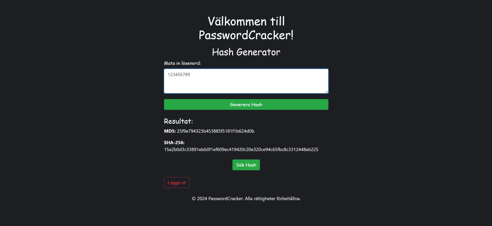

# PasswordCracker

**PasswordCracker** is a school project that allows users to input a password and receive its hash, either in SHA-256 or MD5 format. The application is designed to check the hashed password against a list of the 10,000 most commonly used passwords, stored separately as MD5 and SHA-256 hashes. The app then searches through these files using binary search to find and return a matching hash if available.

## How It Works

1. **Input**: The user enters a password into the application.
2. **Hashing**: The application generates either an MD5 or SHA-256 hash based on the user's selection.
3. **Search**: It compares this hash against the precomputed hashes from the list of common passwords.
4. **Result**: If a match is found, the app displays the matching hash; otherwise, it notifies the user that no match was found.

## Screenshots

### Login

### Index

### Hash Generation

### Result

